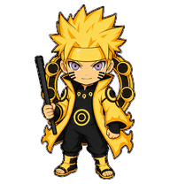

# codex-pets

**简体中文** | [English](./README_EN.md)

一个用于收集和分享 Codex 宠物资源的公开仓库。

网站代码采用 MIT 开源，宠物素材按目录分别授权；完整范围见[许可证与素材权利](#许可证与素材权利)。

> 🌐 **在线图鉴：** [前往 Codex Pets 网站](https://yakun9.github.io/codex-pets/)，浏览宠物预览、筛选作品，并一键复制 AI 安装提示词。

## 宠物索引

| 预览 | 名称 | ID | 版本 | 介绍 | 贡献者 | 路径 |
| :---: | --- | --- | ---: | --- | --- | --- |
|  | 刻晴 | `genshin-impact-keqing` | 2 | 《原神》刻晴的官方设定风 Q 版 Codex 宠物，干练优雅，带有鲜明的雷元素气质。 | [YaKun9](https://github.com/YaKun9) | [查看](./genshin-impact-keqing/) |
|  | 神里绫华 | `genshin-impact-kamisato-ayaka` | 2 | 《原神》神里绫华的官方设定风 Q 版 Codex 宠物，优雅端庄，保留霜华气质与标志性的白蓝和服甲胄造型。 | [YaKun9](https://github.com/YaKun9) | [查看](./genshin-impact-kamisato-ayaka/) |
|  | 六道鸣人 | `naruto-six-paths` | 2 | 鸣人六道仙人形态的 Q 版动画宠物，金色查克拉外衣与六道纹样醒目，勇敢而温暖。 | [GitXMING](https://github.com/GitXMING) | [查看](./naruto-six-paths/) |
|  | 爻光·摇摇 | `honkai-star-rail-yaoguang-yaoyao` | 2 | 《崩坏：星穹铁道》爻光的联名摇一摇灵感 Q 版 Codex 宠物，保留银白长发、青蓝孔雀羽饰与仙舟华丽装束。 | [YaKun9](https://github.com/YaKun9) | [查看](./honkai-star-rail-yaoguang-yaoyao/) |
|  | 黄泉 | `honkai-star-rail-acheron` | 2 | 《崩坏：星穹铁道》黄泉的精美官方设定风 Q 版 Codex 宠物，冷艳沉静，携长刀并带有红白雷光拔刀演出。 | [YaKun9](https://github.com/YaKun9) | [查看](./honkai-star-rail-acheron/) |
|  | 尤诺 | `wuthering-waves-iuno` | 2 | 《鸣潮》月相主题共鸣者尤诺的灵动优雅 Q 版 Codex 宠物，保留深蓝渐变长发、金色头饰与月环意象。 | [yanhuuo](https://github.com/yanhuuo) | [查看](./wuthering-waves-iuno/) |
|  | 穗穗 | `wuthering-waves-suisui` | 2 | 《鸣潮》穗穗的温婉灵动 Q 版 Codex 宠物，保留金白长发、白金长旗袍前襟、蓝金水袖、水扇与红色饰件。 | [mizunagare](https://github.com/mizunagare) | [查看](./wuthering-waves-suisui/) |
|  | 爱弥斯 | `wuthering-waves-aemeath` | 2 | 《鸣潮》爱弥斯的星海歌姬风 Q 版 Codex 宠物，保留粉色长马尾、金色眼眸、青色晶体发饰与白蓝星空驾驶员礼服。 | [mizunagare](https://github.com/mizunagare) | [查看](./wuthering-waves-aemeath/) |
|  | 篮球哥哥 | `original-zongzhu-basketball-chicken` | 2 | 篮球哥哥是一个以宗主经典篮球舞台形象为原型的原创 Codex 宠物，保留蓬松中分发型、黑色高领、白色背带与篮球舞步等标志性元素。 | [YaKun9](https://github.com/YaKun9) | [查看](./original-zongzhu-basketball-chicken/) |
|  | 涛涛 | `original-taotao` | 2 | 涛涛是一个面向开发者社区的原创 IT 吉祥物，拥有短黑发、灿烂笑容和黑色连帽衫，以阳光开朗的形象与活力十足的背带舞陪伴每一次编码。 | [GitXMING](https://github.com/GitXMING) | [查看](./original-taotao/) |

## 使用方式

### 手动安装

1. 克隆仓库并进入项目目录：

```bash
git clone https://github.com/YaKun9/codex-pets.git
cd codex-pets
```

2. 从宠物索引中选择一个 ID，将整个宠物目录复制到 Codex 的 `pets` 目录。设置了 `CODEX_HOME` 时使用 `$CODEX_HOME/pets/`，否则使用 `~/.codex/pets/`。

Windows PowerShell：

```powershell
$petId = "genshin-impact-keqing"
$codexHome = if ($env:CODEX_HOME) { $env:CODEX_HOME } else { Join-Path $HOME ".codex" }
$petsDir = Join-Path $codexHome "pets"

New-Item -ItemType Directory -Force -Path $petsDir | Out-Null
Copy-Item -Recurse -LiteralPath (Join-Path $PWD $petId) -Destination $petsDir
```

macOS / Linux：

```bash
PET_ID="genshin-impact-keqing"
CODEX_HOME="${CODEX_HOME:-$HOME/.codex}"

mkdir -p "$CODEX_HOME/pets"
cp -R "./$PET_ID" "$CODEX_HOME/pets/"
```

3. 在 ChatGPT 桌面端打开 **Settings > Pets**，选择 **Refresh** 后选中宠物，再输入 `/pet` 唤醒。Codex CLI 中可输入 `/pets` 或 `/pet` 打开宠物选择器。

自定义宠物保存在本机，不会自动同步到 ChatGPT Web。更多信息参见 [Pets 官方文档](https://learn.chatgpt.com/docs/pets)。

### 让 AI 安装

将下面的提示词发送给能够访问本机文件和网络的 AI，并把宠物 ID 替换为你想安装的条目：

```text
请帮我安装 Codex 宠物 `genshin-impact-keqing`：

- 从 https://github.com/YaKun9/codex-pets 获取该宠物目录。
- 确定当前用户的 CODEX_HOME；如果未设置，则使用 ~/.codex。
- 将整个宠物目录复制到 <CODEX_HOME>/pets/，最终目录名必须与 pet.json 的 id 一致。
- 确认 pet.json 和 spritesheetPath 指向的精灵图都存在，不要修改宠物资源内容。
- 完成后告诉我实际安装路径，并说明如何在桌面端或 Codex CLI 中选择它。
```

## 目录结构

每个宠物使用独立目录，目录名应与 `pet.json` 中的 `id` 一致，并采用小写 kebab-case。作品角色推荐使用 `<作品>-<角色或形态>`，例如 `genshin-impact-keqing`、`naruto-six-paths`；原创形象可使用 `original-<名称>`，例如 `original-taotao`。

```text
codex-pets/
├── README.md
├── README_EN.md
└── <pet-id>/
    ├── pet.json
    ├── preview.webp
    ├── spritesheet.webp
    └── LICENSE.md
```

`pet.json` 示例：

```json
{
  "id": "series-pet",
  "displayName": "宠物名称",
  "description": "宠物介绍",
  "spriteVersionNumber": 2,
  "spritesheetPath": "spritesheet.webp"
}
```

## 许可证与素材权利

- 网站代码与仓库级文档采用 [MIT License](./LICENSE)。
- 各宠物目录中的 `pet.json`、`preview.webp`、`spritesheet.webp` 和其他宠物专属素材不适用 MIT，具体条款见 [ASSETS_LICENSE.md](./ASSETS_LICENSE.md)。
- 每个宠物目录都必须包含独立的 `LICENSE.md`，该文件是对应素材授权范围的最终依据。
- 已取得作者明确授权、且由贡献者拥有必要权利的原创宠物素材，按照目录中的 `LICENSE.md` 发布；除非另有说明，原创素材采用 CC BY-NC-SA 4.0。许可仅覆盖贡献者实际拥有的原创创作部分，不包含任何第三方权利。
- 在适用法律和相关权利人规则允许的范围内，基于第三方角色制作的同人素材可以按照目录中的 `LICENSE.md` 进行非商业下载、使用、复制、修改和分享，包括 Fork 仓库、提交 PR 以及安装到个人 Codex 环境；不得商用、出售、付费分发或转授权。底层角色、名称、设定与商标权利仍归各自权利人所有，本仓库不代表官方授权或背书。
- 新投稿者提交 PR 前须阅读并同意 [CONTRIBUTING.md](./CONTRIBUTING.md) 中的权利与授权声明。

## 通过 Pull Request 添加宠物

开始制作前，请先阅读 [CONTRIBUTING.md](./CONTRIBUTING.md) 与 [ASSETS_LICENSE.md](./ASSETS_LICENSE.md)。原创素材投稿默认采用 CC BY-NC-SA 4.0；第三方角色同人作品必须如实说明来源，并确保你拥有提交所需的权利。

1. Fork 本仓库，并克隆你的 Fork。
2. 从最新的 `main` 创建分支，推荐命名为 `pet/<pet-id>`。
3. 添加宠物目录、`pet.json`、`spritesheet.webp`、`preview.webp` 和 `LICENSE.md`。`preview.webp` 应为 `192×208` 的透明 WebP，并清晰展示宠物形象；`LICENSE.md` 应与原创或第三方角色素材类型相符。
4. 在中英文 README 的“宠物索引”中增加对应条目，并在预览列引用该宠物的 `preview.webp`。
5. 在 `script.js` 的 `pets` 列表中同步宠物名称、中英文介绍、作品分类、贡献者和主题色，确保 GitHub Pages 图鉴能够展示新宠物；新增分类时也要同步 `seriesLabels`。
6. 提交并推送分支，然后向本仓库的 `main` 分支发起 Pull Request。

```bash
git clone https://github.com/<your-name>/codex-pets.git
cd codex-pets
git switch -c pet/<pet-id>

git add <pet-id> README.md README_EN.md script.js
git commit -m "Add <pet-name> pet"
git push -u origin pet/<pet-id>
```

提交 Pull Request 前请确认：

- 宠物目录名与 `pet.json` 的 `id` 一致。
- `pet.json` 是有效 JSON，且字段完整。
- `spritesheetPath` 指向目录中实际存在的精灵图。
- 宠物目录包含 `192×208` 的透明 `preview.webp`，且预览能够清晰展示宠物形象。
- 宠物目录包含 `LICENSE.md`，并准确说明作者、素材来源、允许的使用方式和第三方权利边界。
- 中英文 README 的宠物索引已经同步更新，并正确引用 `preview.webp`。
- `script.js` 的图鉴条目已同步更新，并使用已存在或新补充的作品分类。
- PR 说明包含角色来源、素材作者、权利确认和适用的素材许可证。
- 本次提交只包含当前宠物相关文件。
